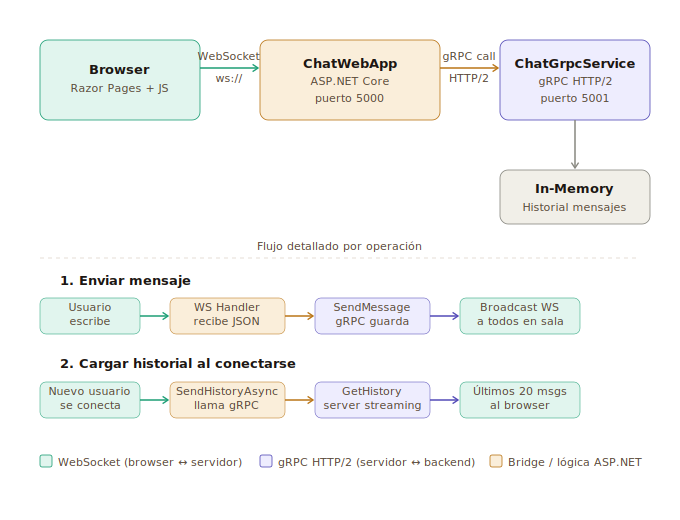

# Demo 1 — Chat en Tiempo Real
## WebSocket + gRPC · ASP.NET Core · .NET 8



---

## ¿Qué demuestra este proyecto?

Este proyecto implementa un **chat en tiempo real** usando dos tecnologías de comunicación complementarias:

- **WebSocket** — para la conexión persistente y bidireccional entre el browser y el servidor.
- **gRPC (HTTP/2)** — para la comunicación interna entre el servidor WebSocket y el servicio de almacenamiento de mensajes.

---

## Arquitectura

```
Browser (Razor Pages)
    │
    │  WebSocket  ws://localhost:5000/ws?room=general&sender=Juan
    │  (conexión persistente, bidireccional)
    ▼
ChatWebApp — ASP.NET Core (puerto 5000)
    │  ChatWebSocketHandler.cs actúa como puente
    │
    ├─ Al recibir mensaje  → llama gRPC SendMessage  → persiste en memoria
    ├─ Al conectarse user  → llama gRPC GetHistory   → devuelve últimos 20 msgs (streaming)
    └─ Broadcast           → reenvía mensaje a todos los WebSockets en la sala
    │
    │  gRPC HTTP/2  (llamadas tipadas, contrato .proto)
    ▼
ChatGrpcService (puerto 5001)
    │
    ├─ SendMessage(ChatMessage) → guarda en lista estática
    └─ GetHistory(HistoryRequest) → stream de mensajes filtrados por sala
         │
         ▼
    In-Memory Store (List<ChatMessage>, máx. 100 mensajes)
```

---

## Estructura de proyectos

```
Demo1_ChatWsGrpc/
├── Demo1_ChatWsGrpc.sln          ← Abrir en Visual Studio
│
├── ChatGrpcService/              ← Proyecto 1: Servidor gRPC
│   ├── Protos/
│   │   └── chat.proto            ← Contrato de los servicios gRPC
│   ├── Services/
│   │   └── ChatServiceImpl.cs    ← Implementación: SendMessage + GetHistory
│   ├── Program.cs
│   └── appsettings.json          ← Puerto 5001 (HTTP/2)
│
└── ChatWebApp/                   ← Proyecto 2: Frontend + WebSocket
    ├── Protos/
    │   └── chat.proto            ← Copia del proto (genera cliente gRPC)
    ├── Services/
    │   └── ChatWebSocketHandler.cs  ← Puente WebSocket ↔ gRPC
    ├── Pages/
    │   ├── Index.cshtml          ← Pantalla de login (nombre)
    │   └── Chat.cshtml           ← Interfaz de chat con WebSocket JS
    ├── wwwroot/css/
    │   └── chat.css
    ├── Program.cs                ← Configura WebSockets + ruta /ws
    └── appsettings.json          ← Puerto 5000 + URL del gRPC
```

---

## Contrato gRPC (`chat.proto`)

```protobuf
service ChatService {
  rpc SendMessage (ChatMessage) returns (ChatResponse);
  rpc GetHistory  (HistoryRequest) returns (stream ChatMessage);
}

message ChatMessage {
  string sender  = 1;
  string content = 2;
  string room    = 3;
  string sent_at = 4;
}
```

- **SendMessage** — RPC unario: envía un mensaje, recibe confirmación.
- **GetHistory** — RPC con *server-side streaming*: el servidor envía múltiples mensajes al cliente uno a uno.

---

## Flujo paso a paso

### Cuando un usuario se conecta

1. Browser abre WebSocket: `ws://localhost:5000/ws?room=general&sender=Juan`
2. `ChatWebSocketHandler.HandleAsync()` registra el socket en el diccionario de la sala.
3. Se llama `SendHistoryAsync()` → hace RPC `GetHistory` al gRPC → recibe mensajes en stream → los reenvía al browser como JSON.
4. Se hace broadcast a toda la sala: _"Juan se unió al chat"_.

### Cuando se envía un mensaje

1. Browser envía JSON por WebSocket: `{ "type": "message", "sender": "Juan", "content": "Hola", "room": "general" }`.
2. `ChatWebSocketHandler` deserializa el mensaje.
3. Llama `PersistToGrpcAsync()` → RPC `SendMessage` al gRPC → se guarda en memoria.
4. Llama `BroadcastAsync()` → serializa a JSON **en camelCase** → envía a todos los WebSockets activos en la sala.
5. Cada browser recibe el mensaje y lo renderiza con el color asignado al sender.

### Cuando un usuario se desconecta

1. El loop `ReceiveAsync` detecta cierre o excepción.
2. Se elimina el socket del diccionario de la sala.
3. Se hace broadcast: _"Juan abandonó el chat"_.

---

## Detalles técnicos importantes

| Aspecto | Detalle |
|---|---|
| Serialización JSON | `JsonNamingPolicy.CamelCase` — necesario para que el JS del browser reciba `type`, `sender`, `content` en minúscula |
| Nombres con tilde | Se usa `Uri.EscapeDataString()` en Razor + `decodeURIComponent()` en JS para evitar que "José" se muestre como `Jos&#xE9;` |
| gRPC streaming | `GetHistory` usa `IServerStreamWriter<ChatMessage>` — el servidor envía mensajes de forma incremental |
| Reconexión | El cliente WebSocket reconecta automáticamente cada 3 segundos si se pierde la conexión |
| Colores por usuario | Cada sender recibe un color único de una paleta de 8 colores, asignado en el orden de aparición |

---

## Cómo ejecutar

### Prerrequisitos
- .NET 8 SDK

### Opción A — Visual Studio
1. Abrir `Demo1_ChatWsGrpc.sln`
2. Clic derecho en la solución → **Set Startup Projects** → **Multiple startup projects**
3. Poner `ChatGrpcService` y `ChatWebApp` ambos en **Start**
4. Presionar **F5**

### Opción B — Línea de comandos

```bash
# Terminal 1
cd ChatGrpcService
dotnet run

# Terminal 2
cd ChatWebApp
dotnet run
```

### Usar la app
1. Abrir http://localhost:5000
2. Ingresar un nombre y hacer clic en **Entrar al chat**
3. Abrir otra pestaña o navegador con un nombre distinto para probar el chat multiusuario

---

## Paquetes NuGet

| Proyecto | Paquete | Versión |
|---|---|---|
| ChatGrpcService | `Grpc.AspNetCore` | 2.62.0 |
| ChatWebApp | `Grpc.AspNetCore` | 2.62.0 |
| ChatWebApp | `Grpc.Net.Client` | 2.62.0 |
| ChatWebApp | `Google.Protobuf` | 3.27.1 |
| ChatWebApp | `Grpc.Tools` | 2.62.0 |

---

## Diferencia entre WebSocket y gRPC en este proyecto

| | WebSocket | gRPC |
|---|---|---|
| **Usado para** | Browser ↔ Servidor | Servidor ↔ Backend |
| **Protocolo** | WS (sobre TCP) | HTTP/2 |
| **Formato** | JSON texto libre | Protocol Buffers (binario) |
| **Dirección** | Bidireccional | Unario + Server Streaming |
| **¿Por qué?** | Los browsers no soportan gRPC nativo | Comunicación tipada y eficiente entre servicios |
