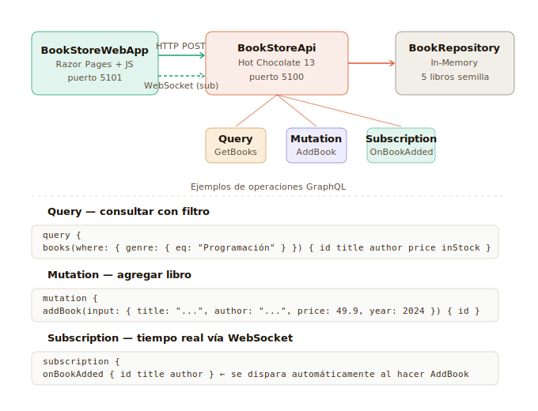

# Demo 2 — Catálogo de Libros
## GraphQL · Hot Chocolate 13 · ASP.NET Core · .NET 8



---

## ¿Qué demuestra este proyecto?

Este proyecto implementa una **API GraphQL completa** con las tres operaciones fundamentales:

- **Query** — consultar libros con filtros y ordenamiento dinámico.
- **Mutation** — agregar o eliminar libros.
- **Subscription** — recibir notificaciones en tiempo real cuando se agrega un nuevo libro (vía WebSocket).

---

## Arquitectura

```
Browser (Razor Pages)
    │
    ├── HTTP POST  →  Query / Mutation  →  /graphql
    │       Respuesta JSON con exactamente los campos pedidos
    │
    └── WebSocket  →  Subscription  →  /graphql (protocolo graphql-transport-ws)
            El servidor notifica automáticamente cuando se dispara un evento

    ▼
BookStoreApi — Hot Chocolate (puerto 5100)
    │
    ├── Query.cs       → GetBooks (con filtros y sorting automático)
    │                    GetBook(id)
    │
    ├── Mutation.cs    → AddBook(input)   → persiste + publica evento "BookAdded"
    │                    DeleteBook(id)   → elimina de repositorio
    │
    ├── Subscription.cs → OnBookAdded    → se activa cuando Mutation publica "BookAdded"
    │
    └── BookRepository  → In-Memory List<Book> con 5 libros de semilla

BookStoreWebApp — Razor Pages (puerto 5101)
    └── Index.cshtml  → UI completa, consume la API GraphQL desde el browser
```

---

## Estructura de proyectos

```
Demo2_GraphQL/
├── Demo2_GraphQL.sln              ← Abrir en Visual Studio
│
├── BookStoreApi/                  ← Proyecto 1: API GraphQL
│   ├── Models/
│   │   └── Book.cs                ← Entidad Book + BookInput
│   ├── Data/
│   │   └── BookRepository.cs      ← Repositorio en memoria, thread-safe
│   ├── GraphQL/
│   │   ├── Queries/
│   │   │   └── Query.cs           ← [UseFiltering] [UseSorting]
│   │   ├── Mutations/
│   │   │   └── Mutation.cs        ← AddBook + DeleteBook + publica evento
│   │   └── Subscriptions/
│   │       └── Subscription.cs    ← OnBookAdded via ITopicEventSender
│   ├── Program.cs                 ← Registra Hot Chocolate + CORS + WebSockets
│   └── appsettings.json           ← Puerto 5100
│
└── BookStoreWebApp/               ← Proyecto 2: Frontend Razor Pages
    ├── Pages/
    │   └── Index.cshtml           ← UI completa con Query, Mutation, Subscription
    ├── wwwroot/css/
    │   └── books.css
    ├── Program.cs
    └── appsettings.json           ← Puerto 5101 + URL de la API GraphQL
```

---

## Las tres operaciones GraphQL

### 1. Query — Consultar libros

```graphql
# Todos los libros
query {
  books {
    id title author genre price year inStock
  }
}

# Con filtro por género
query {
  books(where: { genre: { eq: "Programación" } }) {
    id title author price
  }
}

# Solo libros en stock
query {
  books(where: { inStock: { eq: true } }) {
    id title author
  }
}

# Un libro por ID
query {
  book(id: 1) {
    id title author genre price year inStock
  }
}
```

**Característica clave**: el cliente pide exactamente los campos que necesita. El servidor devuelve solo esos campos — no más.

### 2. Mutation — Modificar datos

```graphql
# Agregar libro (inline, sin variables tipadas)
mutation {
  addBook(input: {
    title: "Clean Architecture"
    author: "Robert C. Martin"
    genre: "Arquitectura"
    price: 55.90
    year: 2017
  }) {
    id title author inStock
  }
}

# Eliminar libro
mutation {
  deleteBook(id: 3) {
    id title
  }
}
```

Cuando se ejecuta `addBook`, internamente se llama a `ITopicEventSender.SendAsync("BookAdded", book)` — esto dispara la Subscription automáticamente.

### 3. Subscription — Tiempo real

```graphql
subscription {
  onBookAdded {
    id title author genre price
  }
}
```

- La conexión usa el protocolo `graphql-transport-ws` sobre WebSocket.
- El browser se suscribe una vez al cargar la página.
- Cada vez que alguien hace `addBook` (desde cualquier cliente), todos los suscriptores reciben la notificación automáticamente.

---

## Flujo paso a paso

### Al cargar la página

1. `BookStoreWebApp` renderiza `Index.cshtml`, inyectando la URL de la API desde `appsettings.json`.
2. El JS llama `loadBooks()` → hace HTTP POST con query GraphQL → recibe JSON → renderiza las tarjetas.
3. El JS llama `startSubscription()` → abre WebSocket a `ws://localhost:5100/graphql` → envía `connection_init` → recibe `connection_ack` → envía mensaje `subscribe` con la query de subscription.

### Al agregar un libro

1. Usuario llena el formulario y hace clic en **Agregar libro**.
2. El JS construye una mutation inline y la envía como HTTP POST.
3. Hot Chocolate ejecuta `Mutation.AddBook()` → llama `repo.Add()` → llama `sender.SendAsync("BookAdded", book)`.
4. El `ITopicEventSender` de Hot Chocolate publica el evento en memoria.
5. Todos los clientes suscritos reciben automáticamente el mensaje por WebSocket.
6. La UI muestra un toast _"Nuevo libro: Clean Architecture"_ y recarga el catálogo.

### Al consultar con filtros

1. Usuario selecciona género y/o activa "Solo en stock".
2. El JS construye la query GraphQL con las cláusulas `where` correspondientes.
3. La query se muestra en la sección **Query enviada** — útil para demostrar la transparencia de GraphQL.
4. Hot Chocolate aplica los filtros con `[UseFiltering]` automáticamente.

---

## Detalles técnicos importantes

| Aspecto | Detalle |
|---|---|
| Filtros automáticos | `[UseFiltering]` en `Query.cs` habilita `where: { campo: { eq/gt/lt/... } }` sin código extra |
| Sorting automático | `[UseSorting]` habilita `order: { campo: ASC/DESC }` |
| Subscriptions | `HotChocolate.Subscriptions.InMemory` — no requiere Redis ni infraestructura externa |
| CORS | Configurado en `Program.cs` para permitir que la WebApp consuma la API desde otro puerto |
| WebSocket para subs | `app.UseWebSockets()` debe estar antes de `app.MapGraphQL()` |
| Playground | Banana Cake Pop disponible en http://localhost:5100/graphql |
| Thread-safety | `BookRepository` usa `lock` para acceso seguro desde múltiples requests paralelos |

---

## Cómo ejecutar

### Prerrequisitos
- .NET 8 SDK

### Opción A — Visual Studio
1. Abrir `Demo2_GraphQL.sln`
2. Clic derecho en la solución → **Set Startup Projects** → **Multiple startup projects**
3. Poner `BookStoreApi` y `BookStoreWebApp` ambos en **Start**
4. Presionar **F5**

### Opción B — Línea de comandos

```bash
# Terminal 1
cd BookStoreApi
dotnet run

# Terminal 2
cd BookStoreWebApp
dotnet run
```

### URLs disponibles
| URL | Descripción |
|---|---|
| http://localhost:5101 | Aplicación web (UI completa) |
| http://localhost:5100/graphql | Banana Cake Pop (playground interactivo) |

---

## Explorar con Banana Cake Pop

El playground de Hot Chocolate en http://localhost:5100/graphql permite:

1. **Explorar el schema** — ver todos los tipos, queries, mutations y subscriptions disponibles con documentación automática.
2. **Ejecutar queries** — probar cualquier operación con autocompletado.
3. **Probar subscriptions** — abrir una pestaña de subscription y en otra ejecutar un `addBook` para ver la notificación en tiempo real.

---

## Paquetes NuGet

| Proyecto | Paquete | Versión |
|---|---|---|
| BookStoreApi | `HotChocolate.AspNetCore` | 13.9.14 |
| BookStoreApi | `HotChocolate.Data` | 13.9.14 |
| BookStoreApi | `HotChocolate.Subscriptions.InMemory` | 13.9.14 |

---

## Ventajas de GraphQL vs REST en este contexto

| | REST | GraphQL |
|---|---|---|
| **Obtener solo título y precio** | GET /books devuelve todos los campos | `{ books { title price } }` devuelve solo esos |
| **Filtrar por género** | GET /books?genre=... (endpoint customizado) | `where: { genre: { eq: "..." } }` estándar |
| **Tiempo real** | Polling o SSE manualmente | Subscription nativa en el protocolo |
| **Documentación** | Swagger aparte | Schema auto-documentado en el playground |
| **Múltiples recursos** | Múltiples requests HTTP | Una sola query puede pedir varios tipos |
